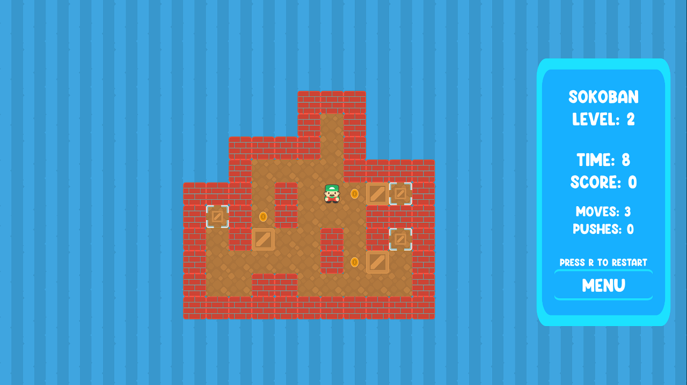
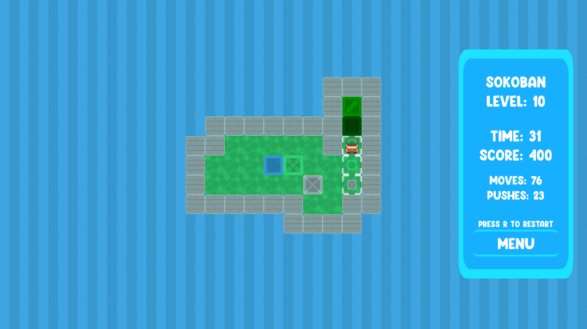

# Sokoban
A sokoban clone written in Godot

Play the game here: https://sp4r0w.itch.io/sokoban

### About
-------------
This is a remake of my older Sokoban made in Godot v3.5.1. The original was written in C# and was quite trash to be honest. It didn't support queueing moves and didn't support reversing your moves. It doesn't help that levels were also way too tough.  
Fortunately, this new version fixes all of the mistakes of the old version.  
As the name suggests, it's a clone of the classic Sokoban, featuring 24 levels, queueing moves and reversing your moves.

This is one of my GDScript games. As the game is very simple, so is the source code. I honestly don't know if I would change anything about this game. It almost makes me a little proud of this small win.  
As always, I added some comments, but I didn't add too much as I think the code is pretty self-explanatory. 
I uploaded this repo and preserved the game for me to look at how much I improve over time. Looking at this game definitely makes me think I improved, even if it's just a tiny bit. 
However, you're free to improve upon this code if you wish to do so :)

### Getting Started
-------------
To compile this project, you will need at least Godot v3.5.1. Do not forget you will need the required export templates.   
More in-depth guide is avaiable here: https://docs.godotengine.org/en/stable/tutorials/export/exporting_projects.html  
You're free to modify the project as you wish.

### Credits
-------------
Thanks to DipShtick (Varga) for testing.  
Graphical assets were made by Kenney (https://kenney.nl/)  
I used the Hyper Casual UI pack by MadFireOn (https://swapnilrane24.itch.io/hyper-casual-ui-free)  
Music was made by VOiD1 Gaming (https://www.void1gaming.com/free-game-menu-music-pack) and Zakiro (https://zakiro101.itch.io/free-casual-game-music-pack-vol-2)  
Sound effects were made by JDSherbert (https://jdsherbert.itch.io/ultimate-ui-sfx-pack)  
Font used is Lemon Days by Khurasan. 

### Preview
-------------

Play the game here: https://sp4r0w.itch.io/sokoban
